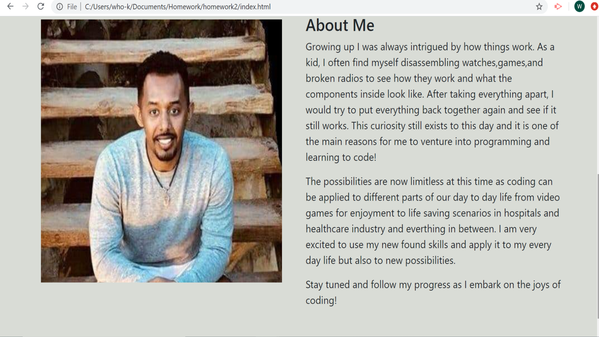
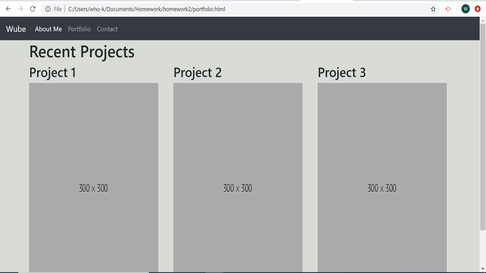
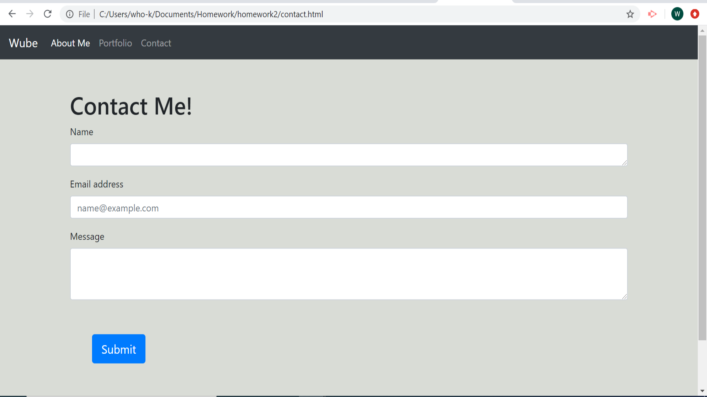

# homework2
# Responsive Portfolio
The goal of this project is to design a responsive a personal portfolio web applications that will render well on a variety of devices and window or screen sizes. This web application has an about me page, portfolio page, and a contact page.

# How it is Made
This web application uses html, css, and bootstrap elements for the different sections.  An additional css styling page was used on top of bootstrap styling.

# Web Application Components
The "About Me" page describes who Wube is and includes a picture. It has bootstraps elements including a navigation bar, grid layout to make it responsive, and a footer. 


The "Portfolio" page has examples of recent projects that will be completed. It is currently set up with placeholder images. A bootstrap container grid layout is used to create 3 columns for that row.


The "Contact" page uses bootstrap forms to receive input from a visitor and uses a bootstrap button for the submittal link.



#Other details
git clone git@github.com/wayele/homework2
cd homework2

```

## Technologies Used

* Html
* CSS/Bootstrap
* JavaScript

## Author

- Wub
